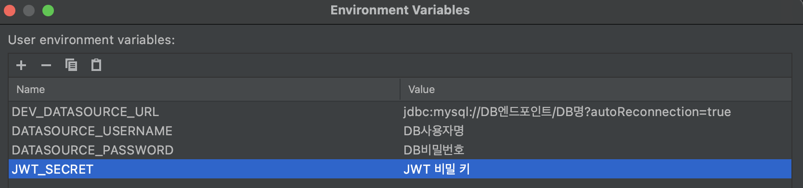

# Spring Boot Template Repository

- 기본적인 스프링 부트 관련 설정들이 되어 있는 템플릿 레포지토리 입니다.
- Spring Boot, JPA, Spring Security에 관련된 의존성들이 추가되어 있습니다.
- JWT 생성 및 검증을 위한 유틸리티 클래스가 있습니다.
- `javax.validation.constraints` 하위의 필드 검증 어노테이션에 지정한 메시지가
  요청 검증에 실패했을 때에 대한 Global Exception Handling이 구현되어 있습니다.  
  (`@Valid`로 검증)
- CORS 설정을 하여 모든 origin으로부터 모든 HTTP Method의 요청을 허용하도록 했습니다.
- Swagger 기본 의존성이 추가되어 있습니다.  
  (`http://localhost:8080/swagger-ui/index.html`)
- Global Exception Handler를 적용하여 예외 발생 시에 대한 공통적인 응답 형식을
  `ErrorResponseDto`로 정의했습니다.

  - 응답 예시
    ```json
    {
      "timestamp": "2021-5-22 16:36",
      "status": 400,
      "error": "Bad Request",
      "message": "Name field is required.",
      "path": "/v1/user",
      "remote": "0:0:0:0:0:0:0:1"
    }
    ```

- JPA가 연결할 데이터베이스 종류가 MySQL, MariaDB로 설정되어 있습니다.
- 데이터베이스와 JWT SecretKey와 관련된 변수들은 아래와 같이 설정되어 있습니다.

  ```properties
  spring.jpa.show-sql=false
  spring.jpa.database-platform=org.hibernate.dialect.MySQL5InnoDBDialect
  spring.jpa.open-in-view=false
  spring.jpa.hibernate.ddl-auto=none
  spring.jpa.properties.hibernate.dialect=org.hibernate.dialect.MySQL5InnoDBDialect
  spring.datasource.url=${DATASOURCE_URL}
  spring.datasource.username=${DATASOURCE_USERNAME}
  spring.datasource.password=${DATASOURCE_PASSWORD}
  spring.datasource.driver-class-name=com.mysql.cj.jdbc.Driver

  jwt.secret=${JWT_SECRET}
  ```

  - 위 설정값에 값을 대입하여 사용하는 방법은 Intellij 기준으로 아래와 같습니다.

    1. 상위의 `Application` => `Edit Configuration`
    2. `Run/Debug Application` 창에서 `Environment` => `Environment Variables`의 오른쪽 아이콘 클릭
    3. 위 yml 파일에 지정해준 이름을 Key값으로 value 각각 설정  
       

- 기본적으로 AccessToken은 1일, RefreshToken은 7일의 수명을 가집니다.   
  AccessToken을 갱신하는 API는 아래와 같습니다.
  
- [POST] `/v1/auth/update-token`
  - Authorization Header: 불필요
  - Request Body
    ```json
    {
      "refreshToken": "string"
    }
    ```
  - Response Body(정상 처리 시)
    ```json
    {
      "accessToken": "string"
    }
    ```
  - 예외상황(ex. refreshToken 수명 만료)들에 대해서는 위에서 정의한   
    `ErrorResponseDto`의 형식으로 응답이 옵니다.